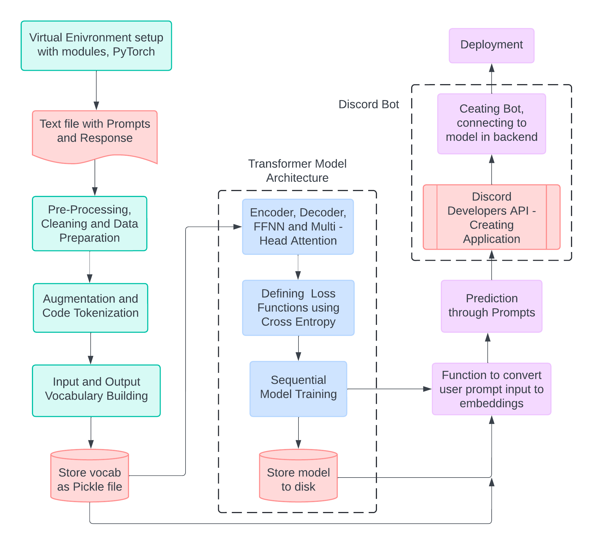

# CONVERSATIONAL AI FOR CODE ASSISTANCE

<hr>

<p style='text-align:center'><i>With the use of a specially created Transformer model that is integrated into PyTorch, this project presents an innovative method for producing Python code from English prompts. The paradigm makes programming more approachable and natural by interpreting plain language instructions and translating them into executable Python code. The model is integrated into a Discord chatbot to enable users to express their programming tasks in simple English and obtain snippets of relevant code. This allows for easier user interaction. This integration aims to improve productivity, assist educational initiatives, and show the useful applications of natural language processing in code production by utilizing the well-liked Discord platform to create an intuitive user experience. </i></p>

<hr>



<hr>

### How to use ?

- It is suggested to create a virtual environment to avoid dependency clashes
    - Creating the environment: ```python -m venv <name>```
    - Using the environment (Windows): ```<name>\Scripts\activate.bat```
    - Using the environment (Linux): ```source <venv>/bin/activate```

- Installing the modules: ```pip install requirements.txt```

